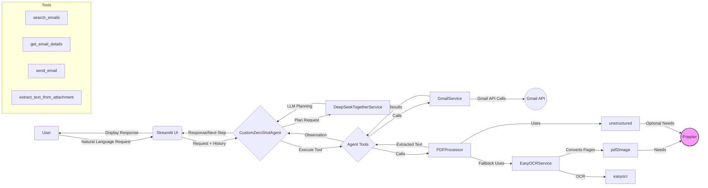

# EmailAgent - Architecture Overview

This document provides a high-level overview of the EmailAgent system architecture. For full details, please refer to the complete `architecture.md` document within the private source code repository.

## Core Architecture: Event-Driven Modular System

The EmailAgent is built on an event-driven architecture with modular components. Key principles include:

-   **Event-Driven Communication**: Loose coupling between components.
-   **Single Responsibility**: Each component has a focused task.
-   **Dependency Injection**: Services receive dependencies instead of creating them.
-   **Modular Code**: Encourages breaking down logic into smaller, manageable files.

## System Workflow Diagram

**Workflow Steps:**

1.  **User Input**: User interacts via Streamlit.
2.  **Agent Planning**: `CustomZeroShotAgent` uses `DeepSeek-V3` (via `Together AI`) to plan the next step (action/question/answer).
3.  **Tool Execution**: Agent selects and executes the appropriate tool.
4.  **Email/Attachment Processing**: Services interact with APIs (`GmailService`) or process files (`PDFProcessor` using `unstructured` or `EasyOCRService`+`Poppler`).
5.  **Observation Generation**: Tool results are fed back to the agent.
6.  **Response/Loop**: Agent generates a response or plans the next step.

## Key Components

*   **Frontend (`Streamlit`)**: User interface.
*   **Agent (`CustomZeroShotAgent`)**: Core orchestrator using LLM planning and tool execution. Relies heavily on few-shot prompting and robust parsing.
*   **LLM Service (`DeepSeekTogetherService`)**: Interface to `DeepSeek-V3` via `Together AI`.
*   **Services (`GmailService`, `EasyOCRService`)**: Handle external interactions (Gmail API, OCR).
*   **Processors (`PDFProcessor`)**: Handle specific data transformations (PDF text extraction).
*   **Tools (`BaseTool` implementations)**: Agent's callable capabilities.

## Technology Stack

*   **LLM:** `DeepSeek-V3` (via `Together AI`)
*   **LLM Platform:** `Together AI`
*   **Framework:** `LangChain` (core concepts), `Streamlit` (frontend)
*   **Email Backend:** `Gmail API` via `google-api-python-client`
*   **Authentication:** `google-auth-oauthlib`
*   **PDF Processing:** `unstructured`, `EasyOCR`, `pdf2image`
*   **System Dependency:** `Poppler` (for PDF rendering)
*   **Core Language:** `Python 3.9+`
*   **Data Validation:** `Pydantic`

This modular design allows for flexibility and integration of various technologies to create an intelligent email assistant.
